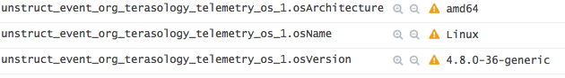
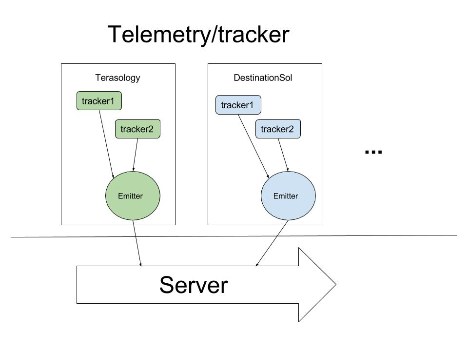

#tracker 8
An easy example of using [snowplow-java-tracker](https://github.com/snowplow/snowplow-java-tracker)
###Overview
- This is one part of telemetry system (the only one part run in the client), the rest will be run on the server
- The version of [snowplow-java-tracker](https://github.com/snowplow/snowplow-java-tracker) is 0.8.0
- Use [snowplow-mini](https://github.com/snowplow/snowplow-mini) to model the back-end system, the system is running on the cloud.
- The metric collected is `osName`, `osVersion` and `osArchitecture`
 

###Set up
Assuming git, Intellij IDEA, JDK8+ installed.
```
host$ git clone https://github.com/GabrielXia/tracker8.git
```
And then open this repository with Intellij

###Explication 
- There is a tracker in class `ReportMetric`, who tracks the event, then send it to the emitter
- There is an Emitter in class `ReportMetric`, who sends this information to the back-end system
- There custom event(now is just os event) is in class `EventsUtils`, the event should structured based on jsonschema in resources

****Note:**** if you want to use a custom event, you should write the json file and register to the back-end system (in order that the server could recognize this event)

###Event sent to sever
Here is some picture showed in the snowplow-mini(the server)



###Development in Terasology telemetry system
Two goals in mind :
- The telemetry system should change the code in terasology as less as possible
- This system could also used for terasology mobile version as well as DestinationSol


Implementation:
- There will be an emitter which sends event to server, using `@in Emitter emitter` inject to other classes
- The trackers will be used in several classes :
    - There might be a `MetricSystem` who `extends BaseComponentSystem implements UpdateSubscriberSystem`. While initializing it could track some basic information such as os, video card,etc. While updating it could track information like memory usage, framerate, etc.
    - The other specific event might be tracked in specific class
    - ??? Have few ideas about how to track exceptions. Maybe we could read log file, so in that case, it might be better to write some code outside the engine
- The other work will have to do in the server 


###A new idea
The user might also want to see some data graph, I think with the telemetry system established, it might be easy to do this locally. E.g. we can set up a local host, and users can see these data graph in the browser