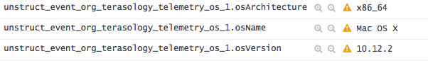
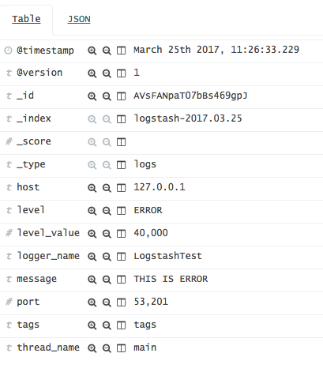
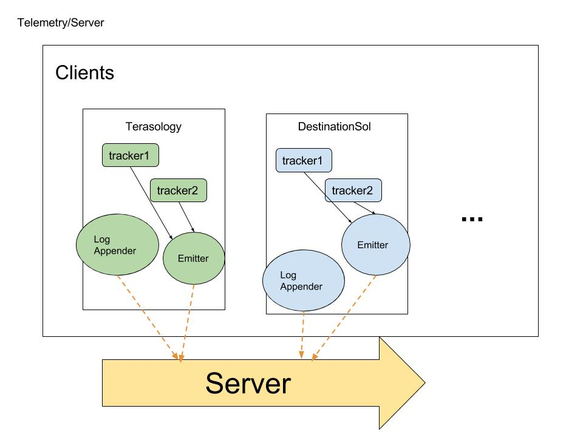

# tracker 8

An easy example of using [snowplow-java-tracker](https://github.com/snowplow/snowplow-java-tracker)
### Overview
- This is one part of telemetry system (the only one runs on the client part), the rest will run on the server
- The version of [snowplow-java-tracker](https://github.com/snowplow/snowplow-java-tracker) is 0.8.0
- Set up a telemetry system locally, see [telemetry](https://github.com/GabrielXia/telemetry)
- Collects metric `osName`, `osVersion` and `osArchitecture`, sends to Collector on `http://localhost:8000`
- Using logback to send `warn` and `error` logs to Logstash on `http://localhost:9600`
 

### Set up
Assuming git, Intellij IDEA, JDK8+ installed.
```
host$ git clone https://github.com/GabrielXia/tracker8.git
```
And then open this repository with Intellij

### Explication 
- There is a tracker in class `ReportMetric`, who tracks the event, then send it to the emitter
- There is an Emitter in class `ReportMetric`, who sends this information to a back-end system
- There custom event(now is just os event) is in class `EventsUtils`, the event should structured based on jsonschema in resources

****Note:**** If you want to use a custom event, you should write a json schema and register to the telemetry system, see [Snowplow/iglu](https://github.com/snowplow/iglu/wiki/Scala-repo)

### Event sent to sever
Here is some information collected by the telemetry system (in the server)





### Development in Terasology telemetry system
Goals in mind :
- ****Users can disable all the metric tracking functions!****
- The telemetry system should change the code in terasology as little as possible
- This system could also be used for terasology mobile version as well as DestinationSol


Implementation:
- There will be an emitter which sends event to server, using `@in Emitter emitter` inject to other classes
- The trackers will be used in several classes :
    - There might be a `MetricSystem` who `extends BaseComponentSystem implements UpdateSubscriberSystem`. While initializing it could track some basic information such as os, video card,etc. While updating it could track information like memory usage, framerate, etc.
    - The other specific event might be tracked in specific class
    - Using Logback appender to send `error` or `warn` logs to the server  
- The other work should to be done in the server 


### Welcome comments !
Feel free to leave comments in [issue](https://github.com/GabrielXia/tracker8/issues) or in [forum](http://forum.terasology.org/threads/telemetry-system-collect-analyze-and-report.1799/), thanks :-)